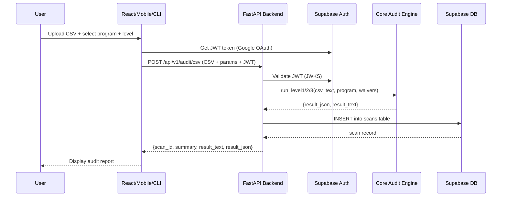

# NSU Audit Core — Full Project Analysis

---

## STEP 1: Project Understanding

### What the Project Does

**NSU Audit Core** is a **graduation audit system** for North South University (NSU). It checks whether a student meets all requirements to graduate from one of three programs:

| Program | Full Name |
|---------|-----------|
| **BSCSE** | BSc in Computer Science & Engineering |
| **BSEEE** | BSc in Electrical & Electronic Engineering |
| **LL.B** | Bachelor of Law (Honors) |

Three audit levels:

| Level | What it does |
|-------|-------------|
| **L1 — Credit Tally** | Counts valid earned credits from the transcript |
| **L2 — CGPA Calculator** | Calculates weighted CGPA, handles waivers and retakes |
| **L3 — Full Audit** | Compares transcript against program rules, finds missing courses, checks prerequisites, capstone, and graduation eligibility |

### Tech Stack

| Layer | Technology |
|-------|-----------|
| Backend API | **FastAPI** (Python) |
| Database | **PostgreSQL via Supabase** |
| Authentication | **Supabase Auth** (Google OAuth 2.0) |
| OCR Engine | **EasyOCR** (Python, CPU-only) |
| Web Frontend | **React 19 + Vite + TailwindCSS 4** |
| Mobile App | **Flutter** (Dart) |
| CLI | **Python** (standalone script) |
| MCP Agent Layer | **MCP Python SDK** (Anthropic) |
| Backend Hosting | **Railway** |
| Frontend Hosting | **Vercel** |
| CI/CD | **GitHub Actions + pre-commit hooks** |
| Load Testing | **Locust** |

### Project Phases

1. **Phase 1 (CLI)** — Command-line audit engine reading CSV transcripts + `program_knowledge_*.md` files. Code lives in `backend/core/`.

2. **Phase 2 (Full-Stack)** — Wrapped Phase 1 inside **FastAPI REST API**, added **Google OAuth** via Supabase, **OCR** for transcript images, **scan history** in PostgreSQL, and built three clients: React Web App, Flutter Mobile App, CLI with `--remote` mode.

3. **Phase 3 (MCP Agentic Layer)** — **MCP server** (`mcp/mcp_server.py`) with 7 tools (Drive browsing, transcript download, audit execution, email sending, history, batch processing). Lets an admin interact via natural language in any MCP-compatible LLM client.

---

## STEP 2: How the Project Works

### Architecture Diagram

```
┌──────────────────────────────────────────────────────────────┐
│                         CLIENTS                              │
│  ┌──────────┐   ┌──────────────┐   ┌───────┐   ┌─────────┐ │
│  │ React    │   │ Flutter      │   │ CLI   │   │  MCP    │ │
│  │ Web App  │   │ Mobile App   │   │ Tool  │   │ Server  │ │
│  └────┬─────┘   └──────┬───────┘   └───┬───┘   └────┬────┘ │
└───────┼────────────────┼───────────────┼────────────┼───────┘
        │                │               │            │
        └────────────────┴───────┬───────┘            │
                                 │ HTTPS REST          │ Direct import
        ┌────────────────────────▼──────────┐         │ (offline)
        │         FastAPI Backend           │         │
        │  Auth → Routers → Services → Core ◄─────────┘
        └────────────────────┬──────────────┘
                             │
        ┌────────────────────▼──────────────┐
        │     Supabase (PostgreSQL)         │
        │   profiles  |  scans              │
        └───────────────────────────────────┘
```

### Key Components

| Component | Location | Purpose |
|-----------|----------|---------|
| **Core Audit Engine** | `backend/core/` | L1, L2, L3 audit logic (Phase 1, reused everywhere) |
| **FastAPI Backend** | `backend/` | REST API with auth, routing, audit + OCR services |
| **Auth Middleware** | `backend/auth.py` | Validates Supabase JWTs, enforces `@northsouth.edu` restriction |
| **Database Layer** | `backend/database.py` | Supabase client for `profiles` and `scans` tables |
| **Routers** | `backend/routers/` | API endpoints: `audit.py`, `history.py`, `users.py` |
| **Services** | `backend/services/` | Business logic: `audit_service.py`, `ocr_service.py`, `scan_service.py` |
| **Program Knowledge** | `program_knowledge/` | Markdown files defining graduation rules per program |
| **React Frontend** | `frontend/src/` | Pages: Login, Upload, Result, History, AdminPanel |
| **Flutter Mobile** | `mobile/lib/` | Screens: login, upload, result, history |
| **CLI Tool** | `cli/audit_cli.py` | Offline + remote audit, Google auth, history |
| **MCP Server** | `mcp/mcp_server.py` | 7 agent tools: Drive, audit, email, batch, history |
| **Archive** | `archive/` | Legacy Phase 1 scripts + batch test files (still relevant) |

### Data Flow (CSV Audit Example)



### Database Schema

Two tables in Supabase PostgreSQL:

- **`profiles`** — Extends `auth.users`: `id`, `email`, `full_name`, `role` (student/admin). Auto-created on signup via trigger.
- **`scans`** — One row per audit run: `user_id`, `student_id`, `program`, `input_type`, `raw_input`, `waivers`, `audit_level`, `result_json` (JSONB), `result_text`.
- **Row Level Security** — Students see only their own scans; admins see all.

---

## STEP 3: How to Run the Project

### Prerequisites

| Tool | Version | Purpose |
|------|---------|---------|
| Python | 3.11+ | Backend, CLI, MCP server |
| Node.js | 18+ | React frontend |
| Flutter SDK | 3.x | Mobile app |
| Supabase account | — | Database + Auth |

### Environment Variables

**Backend** (`backend/.env`):
```
SUPABASE_URL=https://your-project.supabase.co
SUPABASE_ANON_KEY=your_anon_key
SUPABASE_SERVICE_KEY=your_service_key
RAILWAY_PORT=8000
```

**Frontend** (`frontend/.env`):
```
VITE_SUPABASE_URL=https://your-project.supabase.co
VITE_SUPABASE_ANON_KEY=your_anon_key
VITE_API_URL=http://localhost:8000
```

---

### Method 1: Local Development (Recommended)

**Backend:**
```bash
cd backend
python -m venv venv && source venv/bin/activate
pip install -r requirements.txt
cp .env.example .env    # Edit with your Supabase keys
uvicorn main:app --reload --port 8000
```

**Frontend:**
```bash
cd frontend
npm install
cp .env.example .env    # Edit with your keys
npm run dev
```

**Mobile (Flutter):**
```bash
cd mobile
flutter pub get
flutter run              # For device/emulator
```

**CLI (Offline):**
```bash
python cli/audit_cli.py l1 tests/BSCSE/L1/L1_BSCSE_001_basic_passing.csv BSCSE
```

**Quick Launcher Script:**
```bash
./web                    # Interactive menu (recommended)
```

> Previously: `./web local` and `./web local remote` for MCP modes. These are now selectable from the interactive menu.

### Method 2: Production Deployment

| Component | Platform | How |
|-----------|----------|-----|
| Backend | **Railway** | Connect GitHub → set env vars → auto-deploys |
| Frontend | **Vercel** | Import repo → set env vars → auto-deploys |
| Database | **Supabase** | Already hosted |
| Mobile | **Manual** | Build APK and distribute |
| MCP | **Local only** | Runs on admin's machine |

### Method 3: CLI-Only (No Dependencies)

```bash
python cli/audit_cli.py l1 tests/BSCSE/L1/L1_BSCSE_001_basic_passing.csv BSCSE
```
> No internet, no Supabase, no auth needed — uses the core engine directly.

---

## STEP 4: Comparison of Running Methods

| Method | What You Get | Needs Supabase? | Needs Internet? | Best For |
|--------|-------------|-----------------|-----------------|----------|
| **Local Dev** | Full stack | ✅ Yes | ✅ Yes | Active development |
| **CLI Offline** | Audit engine only | ❌ No | ❌ No | Quick audit checks |
| **CLI Remote** | Audit + cloud sync | ✅ Yes | ✅ Yes | Saving results to cloud |
| **Production** | Full app | ✅ Yes | ✅ Yes | End users via browser/mobile |
| **MCP Server** | AI-assisted auditing | Optional | ✅ (for Drive/Gmail) | Admin with LLM client |

---

## ✅ STEP 5: Missing or Unclear Parts (Questions with Answers)

### 1. Hardcoded Supabase URL in `config.py`

**Q:** Is the hardcoded default URL at line 11 of [config.py](file:///home/rafi/Workspace/Projects/cse226_project/project1_antigravity/backend/config.py) intentional?

**A (after investigation):** The code uses `os.getenv("SUPABASE_URL", "https://zxzcnpkfabiiecagczao.supabase.co")` — this means:
- It **first** tries to read `SUPABASE_URL` from your `.env` file
- If the `.env` value is missing, it **falls back** to the hardcoded URL

**What this means for you:** This works fine for development — your actual Supabase project URL is used as a fallback. However, it's a **minor security concern** because the URL is visible in the source code. For a university project this is acceptable, but for a real production app, you'd want to remove the fallback and require the `.env` to always be set.

> [!NOTE]
> **No action needed** — this is working correctly. The hardcoded URL is just a convenience default.

---

### 2. MCP Server Backend URL

**Q:** Where does the MCP server get its backend URL?

**A (after investigation):** I checked [mcp/config.py](file:///home/rafi/Workspace/Projects/cse226_project/project1_antigravity/mcp/config.py) and found it uses **command-line arguments + environment variables**, NOT a `.env` file:

| Mode | How it gets the URL |
|------|---------------------|
| **Offline (default)** | Uses `http://localhost:8000` (or `LOCAL_API_URL` env var) |
| **Remote (`--remote`)** | Uses `https://nsu-audit-api.railway.app` (or `RAILWAY_API_URL` env var) |
| **Custom** | `--api-url https://custom-url.com` overrides everything |

**No `.env.example` needed** — the MCP server is designed to work without one. Everything is configured via CLI flags.

---

### 3. Mobile App Supabase Configuration

**Q:** Where are the Supabase URL and anon key configured in the mobile app?

**A:** They use Flutter's **build-time environment variables** (`--dart-define`):

- **Supabase URL + Anon Key** → via `--dart-define=SUPABASE_URL=...` and `--dart-define=SUPABASE_ANON_KEY=...` in [auth_service.dart](file:///home/rafi/Workspace/Projects/cse226_project/project1_antigravity/mobile/lib/services/auth_service.dart)
- **API Base URL** → via `--dart-define=API_BASE_URL=...` in [api_service.dart](file:///home/rafi/Workspace/Projects/cse226_project/project1_antigravity/mobile/lib/services/api_service.dart)

**To build for production:**
```bash
flutter build apk --dart-define=SUPABASE_URL=https://your-project.supabase.co                  --dart-define=SUPABASE_ANON_KEY=your_key                  --dart-define=API_BASE_URL=https://your-api.railway.app
```

See [mobile/.env.example](file:///home/rafi/Workspace/Projects/cse226_project/project1_antigravity/mobile/.env.example) for all required variables.

---

### 4. Test Framework

**Q:** Where are the unit tests? Maybe in `archive/src`?

**A (after investigation):** The `archive/src/` directory contains **legacy copies** of the audit engine files (not test files):
- `level1_credit_tally.py`, `level2_cgpa_calculator.py`, `level3_audit_engine.py`
- `external_transfer.py`, `transfer_handler.py`

These are old versions before the code moved to `backend/core/`. They are **not unit tests**.

**Current test situation:**
| What exists | Where |
|-------------|-------|
| **CSV test data** | `tests/BSCSE/`, `tests/BSEEE/`, `tests/LLB/` (54 CSV files) |
| **Batch test scripts** | `archive/testbat/` (`.sh` and `.bat` files that run CLI commands) |
| **Load test** | `tests/locustfile.py` (Locust, simulates 20 concurrent users) |
| **OCR test** | `tests/test_ocr.py` |

| **CI pipeline expects** | `pytest tests/ -v` (in `.github/workflows/ci.yml`) |

> [!IMPORTANT]
> **What's missing:** There are **no `pytest`-based unit tests** for the core L1/L2/L3 functions. The CI pipeline at [ci.yml](file:///home/rafi/Workspace/Projects/cse226_project/project1_antigravity/.github/workflows/ci.yml) runs `pytest tests/ -v` but there are no `test_*.py` files (except `test_ocr.py`). This means `pytest` would likely find no tests to run (or only run the OCR test). If you want proper automated testing, you'd need to create `pytest` test files that import and test `run_level1()`, `run_level2()`, and `run_level3()`.

---

### 5. Archive Directory

**Q:** Is it still relevant?

**A:** Yes — confirmed by user. The `archive/` directory contains:
- `archive/src/` — Legacy Phase 1 audit engine files (before they moved to `backend/core/`)
- Note: `external_transfer.py` and `transfer_handler.py` now exist in **both** `archive/src/` (legacy) and `backend/core/` (API-compatible)
- `archive/scripts/` — Test runner scripts
- `archive/testbat/` — Shell/batch scripts for running CLI test cases
- `archive/test_outputs/` — Expected output files for each test case

---

### 6. GitHub Actions CI/CD

**Q:** Is the CI pipeline active? What does it do?

**A (after investigation):** Yes, there is a CI pipeline file at [ci.yml](file:///home/rafi/Workspace/Projects/cse226_project/project1_antigravity/.github/workflows/ci.yml). Here's what it does in simple terms:

**What is CI/CD?** It stands for **Continuous Integration / Continuous Deployment**. It means: every time you push code to GitHub, an automated system checks your code and deploys it.

**Your pipeline has 3 jobs:**

| Job | What it does | When |
|-----|-------------|------|
| **test** | Installs Python 3.11, runs `black` (code formatting check), `flake8` (linting), `isort` (import sorting), and `pytest` (tests) | Every push/PR to `master` |
| **deploy-backend** | Deploys backend to Railway using `railway up` | Only when pushing to `master` AND tests pass |
| **deploy-frontend** | Deploys frontend to Vercel using `vercel --prod` | Only when pushing to `master` AND tests pass |

> [!WARNING]
> **Potential issue:** The pipeline requires `RAILWAY_TOKEN` and `VERCEL_TOKEN` as GitHub secrets. If you haven't set these in your GitHub repo settings (Settings → Secrets → Actions), the deploy jobs will fail. The test job should work independently though.

---

### 7. The `web` File

**Q:** What is the file called `web` at the project root?

**A:** It's a **bash launcher script** that starts your entire project with an **interactive menu**:

```bash
./web              # Shows interactive menu (recommended)
```

The menu has 4 options:
1. **Local Deploy** — Backend + Frontend
2. **Local Deploy with MCP** — Backend + Frontend + MCP (offline mode)
3. **Mobile Local Run** — Backend + instructions for Flutter
4. **Exit**

Features:
- Arrow key navigation (↑↓) + Enter to select
- Colorful `rich` + `questionary` UI
- Backend health check before starting frontend
- Port collision detection (warns if 8000/5173 are in use)
- Graceful shutdown on Ctrl+C

Internally, it calls `web_launcher.py`. Dependencies (`rich`, `questionary`) are auto-installed if missing.

---

### 8. Frontend `dist/` Committed to Git?

**Q:** Is `frontend/dist/` committed to Git?

**A:** **No, it is NOT committed.** The `.gitignore` has `frontend/dist/` listed, so it's not tracked. The folder exists locally from `npm run build` but is excluded from Git.

The `dist/` folder exists locally on your machine because you ran `npm run build` at some point, but it's correctly excluded from Git. **No problem here.**

---

### 9. CORS Set to `"*"`

**Q:** Is `allow_origins=["*"]` in [main.py](file:///home/rafi/Workspace/Projects/cse226_project/project1_antigravity/backend/main.py) (line 11) a problem?

**A:** Here's what CORS means in simple terms:

- **CORS** (Cross-Origin Resource Sharing) controls **which websites** can talk to your backend API.
- `"*"` means **any website in the world** can call your API. This is fine for development.
- For **production**, you should restrict it to only your Vercel frontend domain.

**Current impact:**
- ✅ **For development:** No problem at all. This is the normal setting.
- ⚠️ **For production:** Slightly risky — anyone could send requests to your API from their own website. However, since all your endpoints require Supabase JWT authentication, unauthorized users can't actually do anything harmful. The auth layer protects you.

**Verdict:** For a university project, this is perfectly fine. No action needed unless your instructor specifically asks about it.
